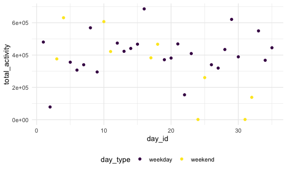

Homework 3
================
Murrel Pereira
10/6/2020

### Problem 1

\#\#Load data

``` r
library(p8105.datasets)

data("instacart")
```

This dataset contains 1384617 rows and 15 columns.

Observations are the level of items in orders by user. There are user /
order variables – user ID, order ID, order day, and order hour. There
are also item variables – name, aisle, department, and some numeric
codes.

How many aisles, and which are most items from?

``` r
instacart %>% 
    count(aisle) %>% 
    arrange(desc(n))
```

    ## # A tibble: 134 x 2
    ##    aisle                              n
    ##    <chr>                          <int>
    ##  1 fresh vegetables              150609
    ##  2 fresh fruits                  150473
    ##  3 packaged vegetables fruits     78493
    ##  4 yogurt                         55240
    ##  5 packaged cheese                41699
    ##  6 water seltzer sparkling water  36617
    ##  7 milk                           32644
    ##  8 chips pretzels                 31269
    ##  9 soy lactosefree                26240
    ## 10 bread                          23635
    ## # … with 124 more rows

Let’s make a plot

``` r
instacart %>% 
    count(aisle) %>% 
    filter(n > 10000) %>% 
    mutate(
        aisle = factor(aisle),
        aisle = fct_reorder(aisle, n)
    ) %>% 
    ggplot(aes(x = aisle, y = n)) + 
    geom_point() + 
    theme(axis.text.x = element_text(angle = 90, vjust = 0.5, hjust = 1))
```


Let’s make a table\!\!

``` r
instacart %>% 
    filter(aisle %in% c("baking ingredients", "dog food care", "packaged vegetables fruits")) %>% 
    group_by(aisle) %>% 
    count(product_name) %>% 
    mutate(rank = min_rank(desc(n))) %>% 
    filter(rank < 4) %>% 
    arrange(aisle, rank) %>% 
    knitr::kable()
```

| aisle                      | product\_name                                 |    n | rank |
| :------------------------- | :-------------------------------------------- | ---: | ---: |
| baking ingredients         | Light Brown Sugar                             |  499 |    1 |
| baking ingredients         | Pure Baking Soda                              |  387 |    2 |
| baking ingredients         | Cane Sugar                                    |  336 |    3 |
| dog food care              | Snack Sticks Chicken & Rice Recipe Dog Treats |   30 |    1 |
| dog food care              | Organix Chicken & Brown Rice Recipe           |   28 |    2 |
| dog food care              | Small Dog Biscuits                            |   26 |    3 |
| packaged vegetables fruits | Organic Baby Spinach                          | 9784 |    1 |
| packaged vegetables fruits | Organic Raspberries                           | 5546 |    2 |
| packaged vegetables fruits | Organic Blueberries                           | 4966 |    3 |

Apples vs ice cream..

``` r
instacart %>% 
    filter(product_name %in% c("Pink Lady Apples", "Coffee Ice Cream")) %>% 
    group_by(product_name, order_dow) %>% 
    summarize(mean_hour = mean(order_hour_of_day)) %>% 
    pivot_wider(
        names_from = order_dow,
        values_from = mean_hour
    )
```

    ## `summarise()` regrouping output by 'product_name' (override with `.groups` argument)

    ## # A tibble: 2 x 8
    ## # Groups:   product_name [2]
    ##   product_name       `0`   `1`   `2`   `3`   `4`   `5`   `6`
    ##   <chr>            <dbl> <dbl> <dbl> <dbl> <dbl> <dbl> <dbl>
    ## 1 Coffee Ice Cream  13.8  14.3  15.4  15.3  15.2  12.3  13.8
    ## 2 Pink Lady Apples  13.4  11.4  11.7  14.2  11.6  12.8  11.9

### Problem 2

``` r
accel_df =
  read_csv("./data/accel_data.csv") %>% 
  janitor::clean_names() %>% 
  pivot_longer(
    activity_1:activity_1440,
    names_to = "minute",
    names_prefix = "activity_",
    values_to = "activity_count"
  ) %>% 
  mutate(
    day_type = case_when(
      day %in% c('Monday', 'Tuesday', 'Wednesday', 'Thursday', 'Friday') ~ "weekday",
      day %in% c('Saturday','Sunday') ~ "weekend"
    ),
    day_type = factor(day_type),
    minute = as.numeric(minute),
    day = factor(day, levels=c('Monday', 'Tuesday', 'Wednesday', 'Thursday', 'Friday','Saturday','Sunday')),
        day = forcats::fct_relevel(day)
  )
```

    ## Parsed with column specification:
    ## cols(
    ##   .default = col_double(),
    ##   day = col_character()
    ## )

    ## See spec(...) for full column specifications.

This dataset contains 50400 rows and 6 columns.

This dataset is 5 weeks of accelerometer data for a 63 year old male
with BMI 25 who is admitted and diagnosed with congestive heart failure
(CHF). After the dataset is tidied, you can see the amount of activity
per minute of the day and see additional variables around day of the
week, etc.

``` r
summary_accel =
accel_df %>% 
  group_by(day_id, day, day_type) %>% 
  summarise(total_activity= sum(activity_count))
```

    ## `summarise()` regrouping output by 'day_id', 'day' (override with `.groups` argument)

``` r
knitr::kable(summary_accel)
```

| day\_id | day       | day\_type | total\_activity |
| ------: | :-------- | :-------- | --------------: |
|       1 | Friday    | weekday   |       480542.62 |
|       2 | Monday    | weekday   |        78828.07 |
|       3 | Saturday  | weekend   |       376254.00 |
|       4 | Sunday    | weekend   |       631105.00 |
|       5 | Thursday  | weekday   |       355923.64 |
|       6 | Tuesday   | weekday   |       307094.24 |
|       7 | Wednesday | weekday   |       340115.01 |
|       8 | Friday    | weekday   |       568839.00 |
|       9 | Monday    | weekday   |       295431.00 |
|      10 | Saturday  | weekend   |       607175.00 |
|      11 | Sunday    | weekend   |       422018.00 |
|      12 | Thursday  | weekday   |       474048.00 |
|      13 | Tuesday   | weekday   |       423245.00 |
|      14 | Wednesday | weekday   |       440962.00 |
|      15 | Friday    | weekday   |       467420.00 |
|      16 | Monday    | weekday   |       685910.00 |
|      17 | Saturday  | weekend   |       382928.00 |
|      18 | Sunday    | weekend   |       467052.00 |
|      19 | Thursday  | weekday   |       371230.00 |
|      20 | Tuesday   | weekday   |       381507.00 |
|      21 | Wednesday | weekday   |       468869.00 |
|      22 | Friday    | weekday   |       154049.00 |
|      23 | Monday    | weekday   |       409450.00 |
|      24 | Saturday  | weekend   |         1440.00 |
|      25 | Sunday    | weekend   |       260617.00 |
|      26 | Thursday  | weekday   |       340291.00 |
|      27 | Tuesday   | weekday   |       319568.00 |
|      28 | Wednesday | weekday   |       434460.00 |
|      29 | Friday    | weekday   |       620860.00 |
|      30 | Monday    | weekday   |       389080.00 |
|      31 | Saturday  | weekend   |         1440.00 |
|      32 | Sunday    | weekend   |       138421.00 |
|      33 | Thursday  | weekday   |       549658.00 |
|      34 | Tuesday   | weekday   |       367824.00 |
|      35 | Wednesday | weekday   |       445366.00 |

``` r
ggplot(summary_accel, aes(x=day_id, y=total_activity,color=day_type)) + geom_point()
```



It looks like the patient has barely any activity on weekends.

``` r
accel_df %>% 
  ggplot(aes(x=minute,y=activity_count,color=day)) + 
    geom_line() +
    facet_grid(week ~day)
```


It looks like the patient was not that active in the beginning but
became more active over time. However, it looks like towards the end of
the 35 day period he started to become less active again. For the middle
of the 35 day period that he was active, it looks like he was active
towards the end of the day.

### Problem 3

``` r
library(p8105.datasets)
data("ny_noaa")
```

## Clean and tidy data

``` r
ny_noaa_df =
ny_noaa %>% 
  janitor::clean_names() %>% 
  mutate(
    date = as.character(date)
  ) %>% 
  separate(date, into = c("year", "month", "day"), sep="-",convert = TRUE) %>% 
  drop_na(tmax)  %>% 
  mutate(
    tmax = as.numeric(as.character(tmax)),
    tmin = as.numeric(as.character(tmin))
  )
```

## Find the most common value for snowfall

``` r
getmode <- function(v) {
    uniqv <- unique(v)
   uniqv[which.max(tabulate(match(v, uniqv)))]
 }

getmode(ny_noaa_df$snow)
```

    ## [1] 0

The most common value for snowfall was 0 mm. This is so because it only
snows for a few months in NYC a year.

``` r
ny_noaa_df_jan =
ny_noaa_df %>% 
filter(month == 1) %>%
group_by(id, year) %>%
summarize(mean_tmax = mean(tmax, na.rm = TRUE))
```

    ## `summarise()` regrouping output by 'id' (override with `.groups` argument)

``` r
plot_jan=
ggplot(ny_noaa_df_jan,aes(x = year, y = mean_tmax, group = id, color = id)) + 
  geom_point() + 
  geom_path() +
  theme(legend.position = "none") +
  labs(
    title = "Temperature plot for January",
    x = "Year",
    y = "Mean Maxiumum temperature (C)",
    caption = "Data from the nyoaa package"
  )

ny_noaa_df_july =
ny_noaa_df %>% 
filter(month == 7) %>%
group_by(id, year) %>%
summarize(mean_tmax = mean(tmax, na.rm = TRUE))
```

    ## `summarise()` regrouping output by 'id' (override with `.groups` argument)

``` r
plot_july=
ggplot(ny_noaa_df_july,aes(x = year, y = mean_tmax, group = id, color = id)) + 
  geom_point() + 
  geom_path() +
  theme(legend.position = "none") +
  labs(
    title = "Temperature plot for July",
    x = "Year",
    y = "Mean Maxiumum temperature (C)",
    caption = "Data from the nyoaa package"
  )
  
plot_jan + plot_july
```


The two plots show that it’s much hotter in July than it is in January.

Make a two panel plot showing :

1)  tmax vs tmin for the full dataset (note that a scatterplot may not
    be the best option)

<!-- end list -->

``` r
tmin_plot =
ny_noaa_df %>% 
  ggplot(aes(y=tmin)) +
  geom_boxplot()

tmax_plot =
ny_noaa_df %>% 
  ggplot(aes(y=tmax)) +
  geom_boxplot()

tmin_plot + tmax_plot
```

    ## Warning: Removed 1918 rows containing non-finite values (stat_boxplot).


``` r
tmin_plot =
ny_noaa_df %>% 
  ggplot(aes(x=tmin)) +
  geom_density()

tmax_plot =
ny_noaa_df %>% 
  ggplot(aes(x=tmax)) +
  geom_density()

tmin_plot + tmax_plot
```

    ## Warning: Removed 1918 rows containing non-finite values (stat_density).


2)  make a plot showing the distribution of snowfall values greater than
    0 and less than 100 separately by year

<!-- end list -->

``` r
ny_noaa_df %>% 
  filter(snow > 0 & snow < 100) %>% 
  ggplot(aes(x=year, y=snow, group=year, color=year)) +
    geom_boxplot()
```


